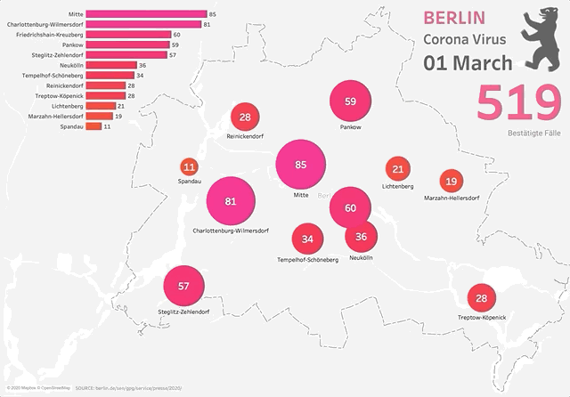

# covid-berlin-dataset
Dataset source: https://www.berlin.de/sen/gpg/service/presse/2020/



[Tableau Dashboard Source](https://public.tableau.com/profile/eddie3094#!/vizhome/CoronaVirusCovid-Berlin/CoronaVirus-Berlin "made by the author")

# Dataset structure
This dataset structure is optimized to be consumed in BI tools such as Tableau. Most of available datasets aren't structured in a ‘import and play' format. 

## Best Practice
The dataset is small enough to be consumed in a google sheet. If you’re a Tableau developer you can simply import the raw CSV file from GitHub in your private google sheet following the instructions below. Most modern Bi tools offers this sort of integration.

## Consuming ‘live’ CSVs in GoogleSheets
Automatically import the raw csv url on google sheets by using `=importdata("csv_url_here")` function. 

### If you want to skip the header
```
=QUERY(IMPORTDATA("https://raw.githubusercontent.com/eddiegueiros/covid-berlin-dataset/master/berlin-covid.csv"),
      "SELECT * OFFSET 1", 0)
```

## Tips for tableau users:
After importing data to google-sheets and building your dashboard, you can simply publish it  on Tableau Public and have it refreshed on a daily basis for free.

